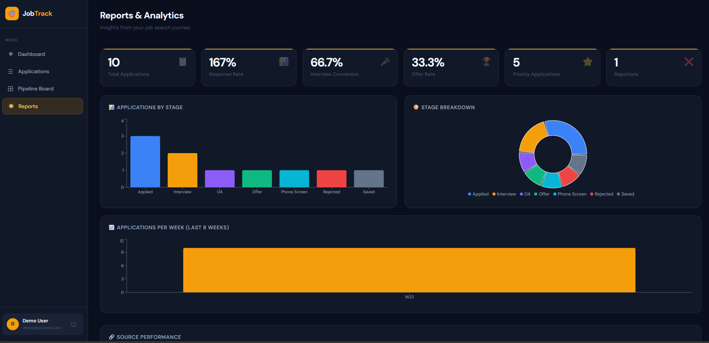
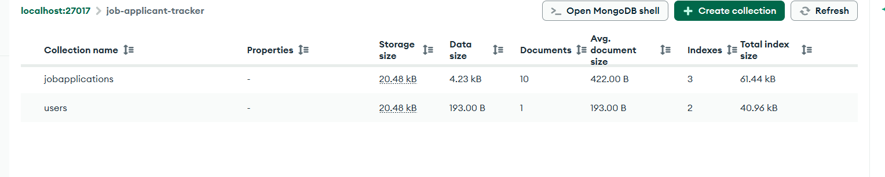

# JobTrack — Job Application Tracker Portal

> A full-stack MERN application to track job applications, interview stages, and get analytics on your job hunt.


---

## Problem Statement

Students and professionals apply to dozens of jobs across LinkedIn, Indeed, Naukri, and company portals. Without a central tracker:

- Applications get forgotten
- Interview dates are missed
- Offer deadlines pass unnoticed
- There's no way to measure what's working

**JobTrack** solves this with a structured, beautiful, and data-driven portal.

---

## Features

| Feature          | Description                                         |
| ---------------- | --------------------------------------------------- |
| Auth             | JWT-based register/login with bcrypt                |
| Add Applications | Company, role, location, salary, source, URL        |
| Stage Tracking   | Saved → Applied → OA → Interview → Offer → Accepted |
| Priority Flag    | Mark important applications                         |
| Search & Filter  | Filter by stage, source; search by company/role     |
| Dashboard        | Stats cards, recent applications, source breakdown  |
| Kanban Board     | Visual pipeline with one-click stage moves          |
| Reports          | Bar charts, pie charts, weekly trends (recharts)    |
| Responsive       | Works on mobile and desktop                         |

---

## Tech Stack

**Frontend**

- React.js 18 (CRA)
- React Router v6
- Axios (API calls with JWT interceptors)
- Recharts (analytics charts)
- React Hot Toast (notifications)
- Custom CSS (dark editorial theme, no framework dependency)

**Backend**

- Node.js + Express.js
- Mongoose (MongoDB ODM)
- bcryptjs (password hashing)
- jsonwebtoken (JWT auth)
- Morgan (request logging)

**Database**

- MongoDB (local or Atlas)

---

## Folder Structure

```
Job-Application-Tracker-Portal/
│
├── client/                      # React frontend
│   ├── public/
│   │   └── index.html
│   ├── src/
│   │   ├── components/          # Reusable components
│   │   │   ├── Layout.js        # App shell + sidebar
│   │   │   └── ApplicationModal.js # Add/Edit modal
│   │   ├── context/
│   │   │   └── AuthContext.js   # Global auth state
│   │   ├── pages/
│   │   │   ├── LoginPage.js
│   │   │   ├── RegisterPage.js
│   │   │   ├── DashboardPage.js
│   │   │   ├── ApplicationsPage.js
│   │   │   ├── KanbanPage.js
│   │   │   └── ReportsPage.js
│   │   ├── utils/
│   │   │   └── api.js           # Axios instance
│   │   ├── App.js               # Root + routes
│   │   └── index.css            # Global styles
│   └── package.json
│
├── server/                      # Express backend
│   ├── config/
│   │   └── db.js                # MongoDB connection
│   ├── controllers/
│   │   ├── authController.js    # Register, login, getMe
│   │   ├── applicationController.js  # Full CRUD
│   │   └── dashboardController.js    # Analytics
│   ├── middleware/
│   │   └── authMiddleware.js    # JWT protect middleware
│   ├── models/
│   │   ├── User.js              # User schema
│   │   └── JobApplication.js   # Application schema
│   ├── routes/
│   │   ├── authRoutes.js
│   │   ├── applicationRoutes.js
│   │   └── dashboardRoutes.js
│   ├── .env.example
│   ├── index.js                 # Server entry point
│   └── package.json
│
├── docs/                        # Screenshots, diagrams
├── .gitignore
└── README.md
```

---

## API Endpoints

### Auth

| Method | Endpoint             | Description                  |
| ------ | -------------------- | ---------------------------- |
| POST   | `/api/auth/register` | Create new user              |
| POST   | `/api/auth/login`    | Login + get JWT              |
| GET    | `/api/auth/me`       | Get current user (protected) |

### Applications (all protected)

| Method | Endpoint                      | Description             |
| ------ | ----------------------------- | ----------------------- |
| GET    | `/api/applications`           | List all (with filters) |
| POST   | `/api/applications`           | Create new application  |
| GET    | `/api/applications/:id`       | Get single application  |
| PUT    | `/api/applications/:id`       | Full update             |
| DELETE | `/api/applications/:id`       | Delete                  |
| PATCH  | `/api/applications/:id/stage` | Update stage only       |

### Dashboard

| Method | Endpoint                 | Description    |
| ------ | ------------------------ | -------------- |
| GET    | `/api/dashboard/summary` | Analytics data |

---

## Installation & Setup

### Prerequisites

| Tool | Version | Notes |
| ---- | ------- | ----- |
| **Node.js** | 18, 20 or 22 (LTS) | Verified on Node 22. `node -v` |
| **npm** | 9+ | ships with Node |
| **MongoDB** | 6.0 or 7.0 | local server, Docker, or a free Atlas cluster |
| **Git** | any | to clone the repo |

Everything runs with two terminals: one for the API, one for the React app.

### 1. Clone the repository

```bash
git clone https://github.com/shourya011/Job-Tracker.git
cd Job-Tracker
```

### 2. Start MongoDB

Pick **one** of the options below — the app only needs a connection string.

<details open>
<summary><b>Option A — Docker (fastest, nothing to install but Docker)</b></summary>

```bash
docker run -d --name jobtrack-mongo -p 27017:27017 -v jobtrack-mongo-data:/data/db mongo:7
```

Stop/start it later with `docker stop jobtrack-mongo` / `docker start jobtrack-mongo`.
</details>

<details>
<summary><b>Option B — native install</b></summary>

**macOS (Homebrew)**

```bash
brew tap mongodb/brew
brew install mongodb-community@7.0
brew services start mongodb-community@7.0      # auto-starts on login
```

**Ubuntu / Debian** — use the line that matches your distro
(`ubuntu jammy` = Ubuntu 22.04, `debian bookworm` = Debian 12):

```bash
sudo apt-get install -y gnupg curl
curl -fsSL https://www.mongodb.org/static/pgp/server-7.0.asc | sudo gpg -o /usr/share/keyrings/mongodb-server-7.0.gpg --dearmor

# Ubuntu 22.04:
echo "deb [ signed-by=/usr/share/keyrings/mongodb-server-7.0.gpg ] https://repo.mongodb.org/apt/ubuntu jammy/mongodb-org/7.0 multiverse" | sudo tee /etc/apt/sources.list.d/mongodb-org-7.0.list
# Debian 12 (instead of the line above):
# echo "deb [ signed-by=/usr/share/keyrings/mongodb-server-7.0.gpg ] https://repo.mongodb.org/apt/debian bookworm/mongodb-org/7.0 main" | sudo tee /etc/apt/sources.list.d/mongodb-org-7.0.list

sudo apt-get update && sudo apt-get install -y mongodb-org
sudo systemctl enable --now mongod
```

If `apt-get install mongodb-org` reports “no installation candidate”, the distro line does not
match your OS release — see the official
[install-on-linux guide](https://www.mongodb.com/docs/manual/administration/install-on-linux/).

**Windows** — download the MSI from
<https://www.mongodb.com/try/download/community>, install with “Install MongoDB as a Service”,
then confirm the service is running in `services.msc`.

**Verify it is up** (any OS):

```bash
mongosh --eval "db.runCommand({ping:1})"      # → { ok: 1 }
```
</details>

<details>
<summary><b>Option C — MongoDB Atlas (cloud, free tier)</b></summary>

1. Create a free cluster at <https://cloud.mongodb.com>.
2. **Database Access** → add a user (username + password).
3. **Network Access** → allow your IP (or `0.0.0.0/0` for quick local testing).
4. **Connect → Drivers** → copy the string and put it in `server/.env` as `MONGO_URI`:
   `mongodb+srv://<user>:<password>@<cluster>.mongodb.net/job-applicant-tracker`
</details>

### 3. Backend (Express API)

```bash
cd server
npm install                 # or: npm ci   (lockfile is in sync)
cp .env.example .env        # Windows: copy .env.example .env
```

Open `server/.env` and set at least these two values:

```
PORT=5000
MONGO_URI=mongodb://127.0.0.1:27017/job-applicant-tracker
JWT_SECRET=<paste a long random string>
JWT_EXPIRES_IN=7d
NODE_ENV=development
```

Generate a secret with:

```bash
node -e "console.log(require('crypto').randomBytes(48).toString('base64url'))"
```

Start the API (auto-restarts on file changes):

```bash
npm run dev
```

> ⚠️ Start MongoDB **before** the API: the server calls `process.exit(1)` if the database
> is unreachable at startup, so it will not stay up until `MONGO_URI` is reachable.

Expected output — if you do **not** see `MongoDB connected: …`, jump to
[Troubleshooting](#troubleshooting):

```
 Server running on port 5000
MongoDB connected: 127.0.0.1
```

> Tip: use `127.0.0.1` rather than `localhost` in `MONGO_URI`. Node 18+ may resolve
> `localhost` to IPv6 `::1` while `mongod` listens only on IPv4, which fails with
> `ECONNREFUSED ::1:27017`.

### 4. Frontend (React app)

In a **second terminal**:

```bash
cd client
npm ci                      # or: npm install
npm start
```

`react-scripts` compiles and opens <http://localhost:3000>. The client calls the API through
`/api`, which `client/package.json` → `"proxy": "http://localhost:5000"` forwards to the backend,
so no CORS setup is needed in development.

### 5. Load demo data (optional but recommended)

The app starts empty — register your own account, or seed a demo user and 10 applications.
With the backend stopped **or** running (both fine):

```bash
cd server
npm run seed
```

```
✅ Demo user created: demo@jobtrack.dev / demo1234
✅ 10 sample applications inserted
```

Log in at <http://localhost:3000/login> with **demo@jobtrack.dev / demo1234**.

### 6. Access the app

| Service | URL |
| ------- | --- |
| Frontend | <http://localhost:3000> |
| API | <http://localhost:5000> |
| API health check | <http://localhost:5000/> → `{"message":"Job Tracker API running "}` |

### Shortcut: run everything from the project root

A tiny root `package.json` is included so you don't have to `cd` around
(it just forwards to the two apps, no extra dependencies):

```bash
npm run install:all     # installs both server/ and client/ dependencies
npm run seed            # inserts the demo user + sample applications
npm run dev:server      # terminal 1 → API on :5000
npm run dev:client      # terminal 2 → React app on :3000
```

### Running the frontend against a remote API (optional)

`client/src/utils/api.js` uses `REACT_APP_API_URL` when it is set. Create `client/.env`:

```
REACT_APP_API_URL=http://localhost:5000/api
```

Leave it unset to use the dev-server proxy (recommended). If the browser then calls the API
from a different origin than `http://localhost:3000`, add that origin to `CLIENT_ORIGIN`
in `server/.env` (comma separated) or `cors` will block the request.

### Production build (optional)

```bash
cd client && npm run build     # static files in client/build/
cd server && npm start         # runs the API without nodemon
```

Serve `client/build/` with any static host (or `npx serve -s build`) and point
`REACT_APP_API_URL` at the deployed API.

### Quick smoke test of the API

```bash
# health
curl http://localhost:5000/

# login (after seeding) and call a protected endpoint
TOKEN=$(curl -s -X POST http://localhost:5000/api/auth/login \
  -H 'Content-Type: application/json' \
  -d '{"email":"demo@jobtrack.dev","password":"demo1234"}' | node -pe "JSON.parse(require('fs').readFileSync(0)).token")

curl -s http://localhost:5000/api/dashboard/summary -H "Authorization: Bearer $TOKEN"
```

---

## Troubleshooting

| Symptom | Cause / fix |
| ------- | ----------- |
| `MongooseServerSelectionError: connect ECONNREFUSED 127.0.0.1:27017` | MongoDB is not running, or `MONGO_URI` is wrong. Start `mongod`/Docker/Atlas and re-check. |
| `ECONNREFUSED ::1:27017` | Node resolved `localhost` to IPv6. Use `mongodb://127.0.0.1:27017/...`. |
| `Error: listen EADDRINUSE :::5000` | Port 5000 already in use — stop the other process or change `PORT` in `server/.env`. |
| `Something is already running on port 3000` | CRA asks to use port 3001 — either accept (and add `http://localhost:3001` to `CLIENT_ORIGIN`) or free port 3000. |
| `npm ci can only install packages when your package.json and package-lock.json are in sync` | The lockfile was out of sync (fixed in this repo). If you hit it, run `npm install` instead, or delete `node_modules` + `package-lock.json` and reinstall. |
| Login returns `Invalid credentials` for the demo user | Seed not run, or `MONGO_URI` points to a different database name than the one that was seeded. Run `npm run seed` again with the backend’s `.env`. |
| Every request returns `401 Not authorized — invalid token` | `JWT_SECRET` changed after the token was issued — log out (or clear `localStorage`) and log in again. |
| API works in Postman but not in the browser console (CORS error) | Add the browsed origin (e.g. `http://127.0.0.1:3000`) to `CLIENT_ORIGIN` in `server/.env` and restart the API. |
| `Cannot find module 'nodemon'` | Dev dependencies not installed — run `npm install` inside `server/`. |
| Ports in use after a crash | macOS/Linux: `lsof -i :5000` then `kill -9 <pid>`; Windows: `netstat -ano | findstr :5000` then `taskkill /PID <pid> /F`. |

---

## Screenshots

### Register Page


### Login Page


### Dashboard


### Kanban dashboard


### Add Application


### Application


### Reports and Analytics



### MongoDB Collections



## 🎬 Demo Video

[](https://youtu.be/WdKlcD4WcEc)

Click the image above to watch the full demo.

## Learning Outcomes

After building this project you will understand:

- Full-stack MERN architecture and separation of concerns
- JWT authentication flow (register → token → protected routes)
- RESTful API design with Express.js
- Mongoose schema design with relationships
- React Context API for global state
- Axios interceptors for automatic token attachment
- React Router v6 with protected/public routes
- Building reusable components (modals, layouts)
- Data visualization with Recharts
- MongoDB aggregation pipelines for analytics

---

## Author

Sonia Thakur

GitHub:
https://github.com/Sonia068

LinkedIn:
https://www.linkedin.com/in/sonia-thakur-6ab93b349/

---

⭐ If you found this project useful, please give it a star on GitHub.

